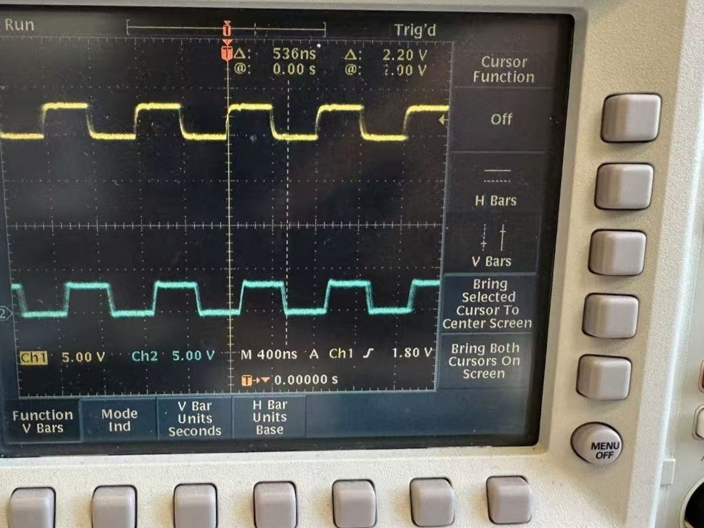
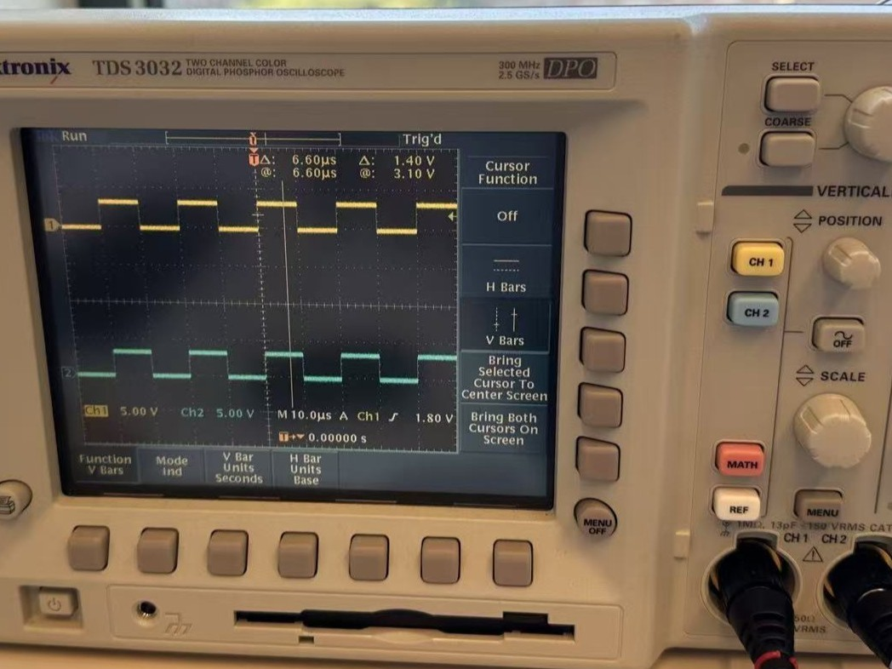
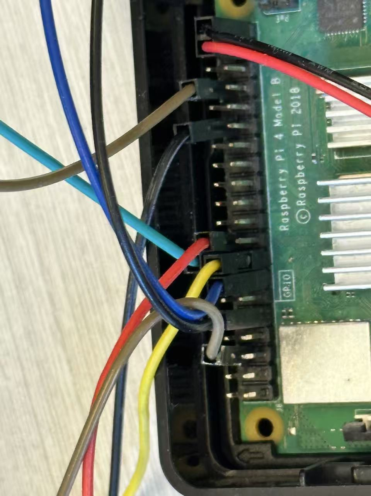

# WiringPi-Python-MultiPin

Fork of [WiringPi-Python](https://github.com/WiringPi/WiringPi-Python) with support for **simultaneous multi-pin GPIO pulse generation** on Raspberry Pi (Tested on model 4B).

Standard WiringPi can only toggle one GPIO pin at a time from Python. This fork adds C-level functions that drive GPIO pins 20-27 simultaneously via direct register writes (`digitalWriteByte2`), achieving simultanous synchronized pulses across up to 8 pins.

This function is mainly used for triggering multiple FMCW radars (TI AWR2243/1243BOOST) for building a multi-static radar array. 

<div align="center" style="margin-top: 1rem;">
  
  <p><em>GPIO output original</em></p>
</div>

<div align="center" style="margin-top: 1rem;">
  
  <p><em>GPIO output modified</em></p>
</div>

This function was used in previous projects:

* 77GHz polarimetric SAR platform: https://github.com/xsun2445/polysight

* Multi-static array with multiple single-chip radars: https://github.com/xsun2445/MulDar

## Pins:

<div align="center" style="margin-top: 1rem;">
  
  <p><em>GPIO pins 20-27</em></p>
</div>

## What was modified

**WiringPi C library** ([fork](https://github.com/xsun2445/WiringPi)):
- Added `sendPulseToRadar(num_loop, pd)` in `wiringPi.c` - generates a pulse train on pins 20-27 with configurable count and period
- Added `sendPulseToRadar2(pins, num_loop, pd, w)` - extended version with pin mask and pulse width control

**WiringPi-Python bindings** ([fork](https://github.com/xsun2445/WiringPi-Python)):
- Added SWIG declarations in `bindings.i` to expose the new C functions to Python
- Version bumped to 3.60.1


## Installation

### 1. Clone the repository

```bash
git clone --recursive https://github.com/xsun2445/WiringPi-Python-MultiPin.git
cd WiringPi-Python-MultiPin
```

If you already cloned without `--recursive`:

```bash
git submodule update --init --recursive
```

### 2. Install the WiringPi C library (optional, for the `gpio` CLI tool)

```bash
cd WiringPi-Python/WiringPi
./build debian
sudo dpkg -i debian-template/wiringpi_3.6_arm64.deb
cd ../..
```

### 3. Build and install the Python module

```bash
cd WiringPi-Python
sudo python3 setup.py install
cd ..
```

### 4. Verify

```python
import wiringpi
wiringpi.wiringPiSetupGpio()
wiringpi.sendPulseToRadar(0xff, 10, 1500)
```

## Usage

### Direct Python API

```python
import wiringpi

wiringpi.wiringPiSetupGpio()

# Send 100 pulses with 1500us period on all 8 pins (20-27)
# pin_mask(0xff select all), num_pulse, period(us), pulsewidth(us)
wiringpi.sendPulseToRadar2(0xff, 100, 1500, 1)
```

### TCP trigger server

A TCP server that accepts trigger commands over the network:

```bash
sudo python3 trigger_server.py --port 5000
```

A client connects to a remote server and triggers on command:

```bash
sudo python3 trigger_client.py 192.168.1.100 --port 5000
```

### Standalone trigger (no network)

`hard_trigger.py` runs continuous pulse trains without a TCP server:

```bash
# Continuous free-running pulse loop
sudo python3 hard_trigger.py --num-pulses 100 --period-us 1500

# Motor-triggered mode: waits for a rising edge on input pin 26,
# then fires a pulse train on each trigger event. This is used for 
# collecting SAR on a motion stage
sudo python3 hard_trigger.py --mode motor --num-pulses 100 --period-us 1500
```

### Message protocol

Commands use the format: `{greeting}{delimiter}{num_frames}{delimiter}{period_ms}`

Default delimiter is `@$@$`. Example:

```
hello from server!@$@$100@$@$1500
```

## API Reference

| Function | Description |
|----------|-------------|
| `sendPulseToRadar(pins, num_loop, pd)` | Send `num_loop` pulses with `pd` microsecond period on GPIO pins selected by bitmask `pins` |
| `sendPulseToRadar2(pins, num_loop, pd, w)` | Same as above with pulse width `w` control. pin_mask(0xff select all), num_pulse, period(us), pulsewidth(us)|

